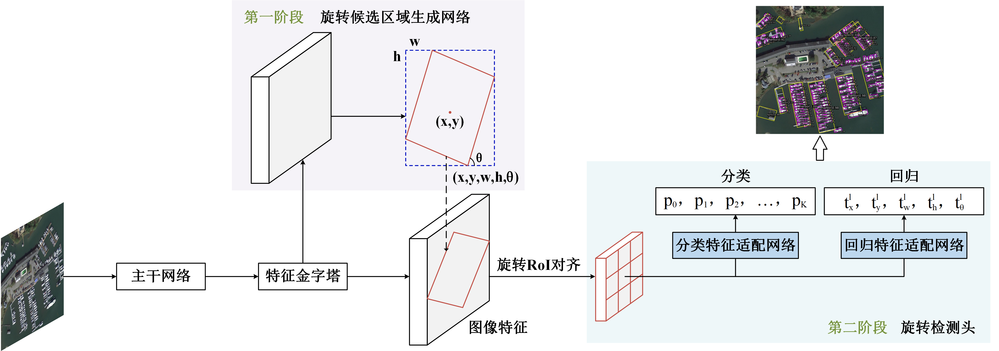

用于DataFountain的基于亚米级影像的精细化目标检测竞赛

比赛相关代码存放于`2023df`下。

比赛链接：[基于亚米级影像的精细化目标检测 竞赛 - DataFountain](https://www.datafountain.cn/competitions/637)

同时也为毕业设计实验一 & 实验二所使用框架。毕设实验一做完啦🥳🥳

---

<h1 align = "center">Rectangular Deformable Convolution: A Flexible and Efficient Method for Remote Sensing Image Object Detection</h1>

This project is base on [open-mmlab/mmrotate](https://github.com/open-mmlab/mmrotate). The relevant experimental code will be made public after the article is accepted.

## How to use

Please refer to the official [documentation](https://mmrotate.readthedocs.io/en/latest/).